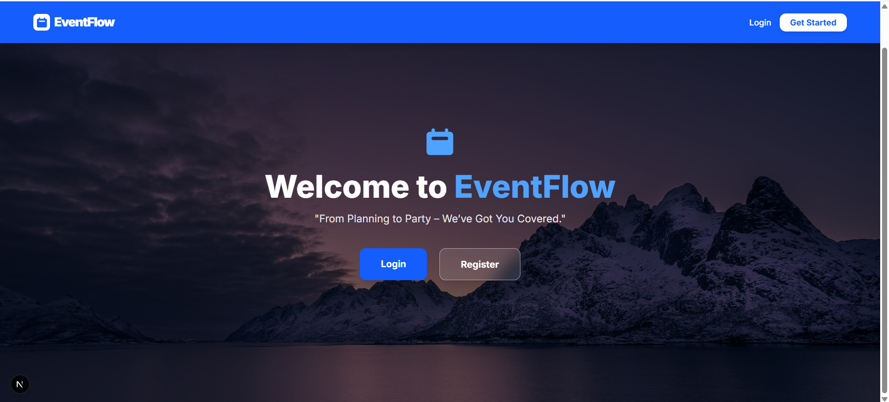
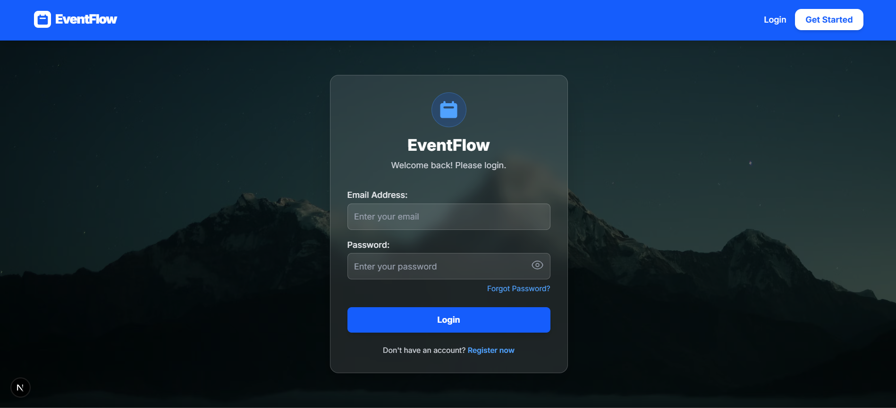
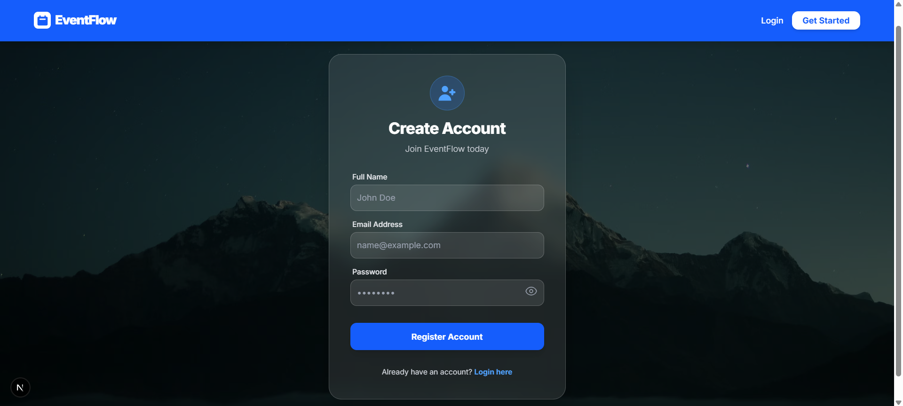
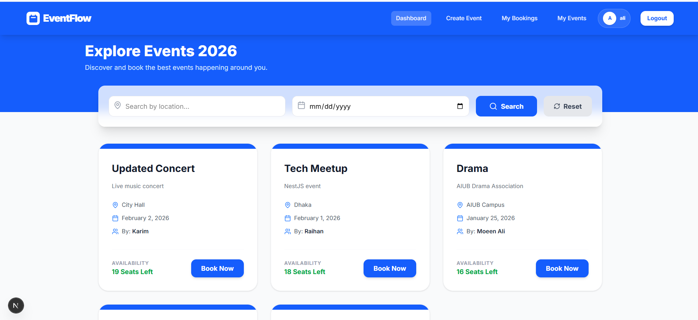
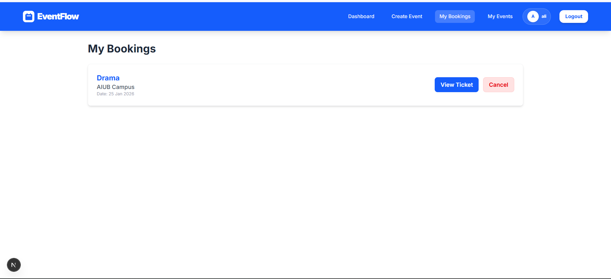
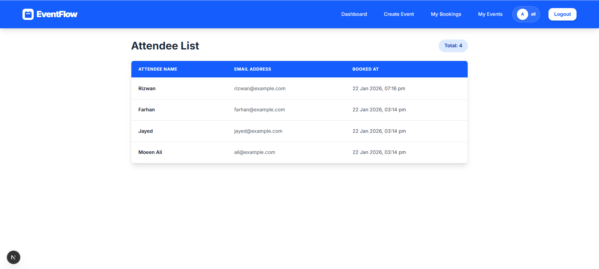
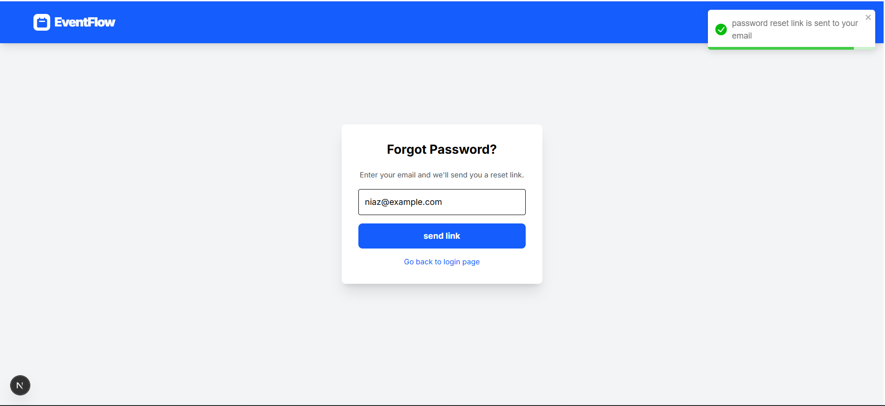
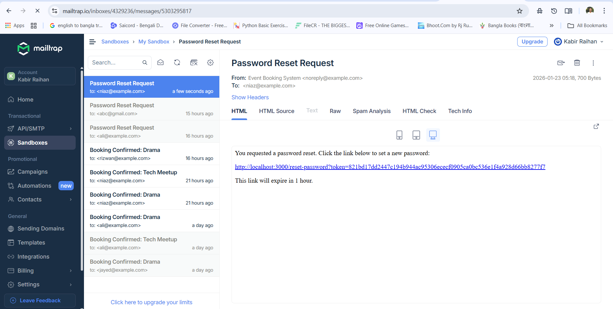
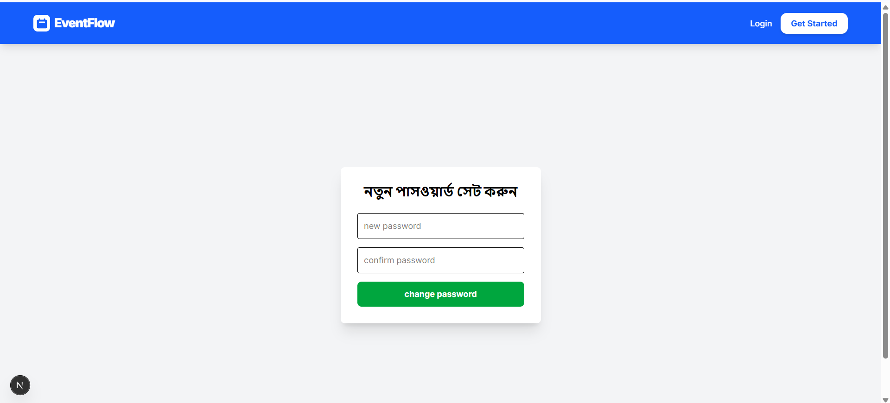
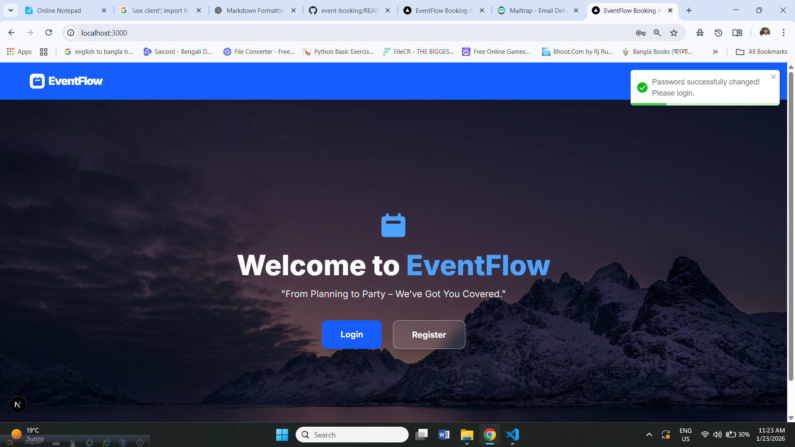

# 📅 Event Management System 2026

A modern, full-stack event discovery and booking platform built with **Next.js 15**, **TypeScript**, and **Tailwind CSS**.  
This application allows users to explore, filter, and book seats for upcoming events in real time.

---

## 🚀 Key Features

- **Dynamic Event Dashboard**  
  View all upcoming events with real-time seat availability.

- **Multi-Filter Search**  
  Find events instantly by **location**, **date**, or both.

- **Seamless Booking**  
  One-click booking system with instant feedback.

- **Authentication Guard**  
  Secure routes ensure only authorized users can access the dashboard and book events.

- **Email Confirmations**  
  Integrated with **Mailtrap** to simulate and test automated booking confirmation emails.

- **Modern UI/UX**  
  Built with glassmorphism styles, Lucide icons, and fully responsive layouts for mobile and desktop.

---

## 🛠 Tech Stack

### Frontend
- Next.js (App Router)
- React 19
- TypeScript

### Styling
- Tailwind CSS

### Icons
- Lucide React

### Backend Communication
- Axios-based API service

### Email Testing
- Mailtrap (for capturing and debugging booking notification emails)

---

##  Email Integration (Mailtrap)

This project uses **Mailtrap** as the SMTP server for email delivery testing.

**Why Mailtrap?**  
It allows the system to send booking confirmation emails safely without sending real emails during the development and testing phase.

**Verification**  
All outgoing **"Booking Successful"** emails can be viewed directly in the Mailtrap dashboard.

---
## 📸 Screenshots
### Landing page

### Login page

### Registration page

### Dashboard page

### My Bookings

### View Profile

### Set new Password

## 📌 Project Status
Active development and testing (2026)
